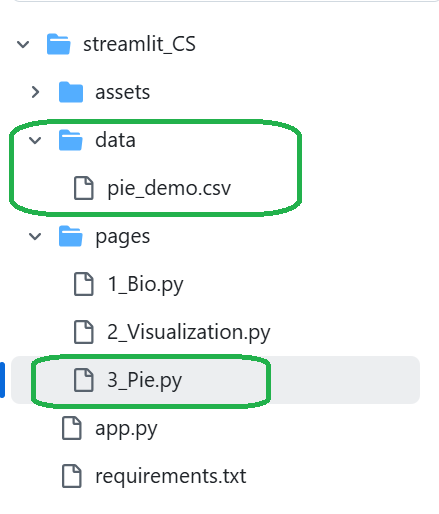

# Prompt


Use AI tools to create a new page 3_Pie, which reads a csv file named pie_demo.csv (save it in a data folder as shown below), with 5 or more data points.

# Response - generated by Claude Sonnet 4.5

I'll create a new page `3_Pie.py` that reads from a CSV file and displays a pie chart. Let me start by creating the data folder and CSV file, then the new page.

**Todo List:**
1. ✅ Create data folder and pie_demo.csv with sample data
2. ✅ Create 3_Pie.py page that reads CSV and displays pie chart
3. ✅ Test the new pie chart page

---

**Created:** `data/pie_demo.csv`
```csv
Category,Value
Technology,35
Healthcare,25
Finance,20
Education,12
Entertainment,8
```

---

**Created:** `pages/3_Pie.py`
```python
import streamlit as st
import pandas as pd
import plotly.express as px
from pathlib import Path

st.title("🥧 Pie Chart Visualization")

st.markdown(
    """
    This page demonstrates a pie chart visualization using data from a CSV file.
    The chart shows the distribution of values across different categories.
    """
)

# Load the CSV file using absolute path
@st.cache_data
def load_pie_data():
    """Load pie chart data from CSV file in the data folder."""
    # Get absolute path to the data folder
    data_path = Path(__file__).parent.parent / "data" / "pie_demo.csv"
    try:
        df = pd.read_csv(data_path)
        return df
    except FileNotFoundError:
        st.error(f"Could not find file at: {data_path}")
        return None
    except Exception as e:
        st.error(f"Error loading data: {e}")
        return None

# ... (rest of the code)
```

---

## Summary of Changes

### 1. Created `data/pie_demo.csv`
A CSV file with 5 data points showing different categories and their values:
- Technology: 35
- Healthcare: 25
- Finance: 20
- Education: 12
- Entertainment: 8

### 2. Created `pages/3_Pie.py`
A comprehensive pie chart visualization page with the following features:

**Core Functionality:**
- Reads data from `data/pie_demo.csv` using absolute path (same approach that fixed your image issue)
- Displays an interactive pie/donut chart using Plotly Express
- Shows raw data in an expandable section

**Interactive Controls:**
- **Color Scheme Selector** - Choose from 6 different color palettes
- **Show Percentages Toggle** - Display or hide percentage labels on the chart
- **Donut Hole Size Slider** - Transform the pie chart into a donut chart by adjusting the center hole size

**Additional Features:**
- Statistics dashboard showing total value, average value, and number of categories
- Highlights the top category
- Interactive legend (click to show/hide categories)
- Hover tooltips with detailed information
- Help section explaining how to use the chart

The page follows the same structure and styling as your existing pages and uses proper error handling. When you refresh your Streamlit app, you should see "3_Pie" appear in the sidebar navigation!